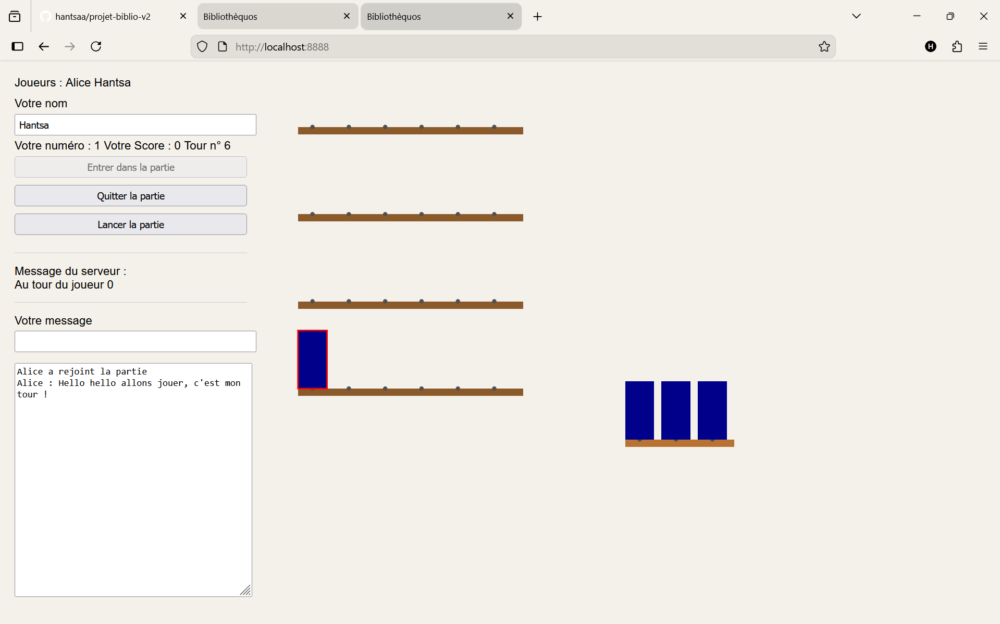

# ***HAI305I Projet JavaScript 2025-2026***

*Participants au projet :* 
- **`Alice GUY`**, *Groupe C*
- **`Hantsa RAMEFISON`**, *Groupe C*

****

## Pour lancer le serveur :
Executer un :

    npm install

Pour pouvoir ne faire que (car on a configuré un package.json) :

    npm start 

au lancement du serveur.

Sinon vous pouviez lancer le serveur comme on a l'habitude de faire : 

    node serveur.io.js

## Pour accéder au jeu : 
Dans deux navigateurs différents, quand le serveur est lancé, taper : 

    localhost:8888

Vous auriez alors un visuel du chat, sur les deux fenêtres, sans la bibliothèque car la partie n'a pas encore été lancée.

Le jeu se joue à `deux` (que l'on peut changer dans ***serveur.io.js*** *(var nbJoueurs = 2)* si vous souhaitez, mais pour faciliter le projet, on a choisi 2 joueurs initialement) donc vous avez besoin de rentrer `un nom dans chaque navigateur` pour pouvoir :
- Entrer dans la partie pour ensuite
- lancer la partie

S'il n'y a qu'un seul joueur qui rentre dans la partie, lance cette partie et veut placer un livre sur les étagères, un message d'erreur s'affichera toujours :

    Soit ce n'est pas votre tour, soit il n'y a pas assez de joueurs (ici 2 !)

Et donc logiquement si ce n'est pas votre tour, ce message s'affichera aussi.

## Brèves explications de `client.html` et `serveur.io.js`
En premier lieu, nous nous sommes chargés de la gestion de la bibliothèque, c'est-à-dire pouvoir charger les livres du JSON pour pouvoir les placer dans un tableau que l'on a initialisé au début *(let livres = [ ])*. Tout ça grâce à la fonction chargerLivres().

En deuxième lieu, nous nous sommes attaqués à la gestion des joueurs :
- initialisation de *numJoueur* et *joueurCourant* à $-1$ pour pouvoir commencer à $0$ quand un joueur rentrera ou joueura son tour
- la demande de la liste des joueurs
- l'entrée du joueur dans la partie
- la sortie du joueur dans la partie  

        Tout ça grâce à socket.emit qui fait le lien client <=> serveur pour envoyer des événements nommés avec des données différents.

En troisième lieu, nous pouvons voir la gestion du chat. On a deux fonctions principaux pour cela :
- *envoiMessage(input)* qui envoie le message au serveur selon le joueur qui a tapé ce message, désigné par son *numJoueur*
- *ajouterMessage(message)* permet ensuite de stocker et d'afficher ce message sur la zone de texte, tout en sautant de ligne à chaque nouveau message.

En quatrième lieu, nous avons nos fameuses socket qui gerent toutes les communications entre le client et le serveur, 

## Aperçus du projet :

